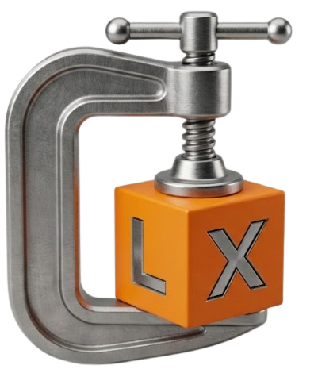

<div align="center">
  
  <br><br>
  

<div id="toc">
  <ul style="list-style: none">
    <summary>
      <h1>Compress</h1>
    </summary>
  </ul>
</div>

**Version 1.4.2**

Free, open source, MIT licensed.

[](https://slint.dev)

</div>

---

## Extremely fast. No waiting.

LRGEX Compress is built around **Zstandard (zstd)** — a modern compression algorithm
optimized for speed. It uses all your CPU cores automatically, so big folders finish
in seconds instead of minutes.

For everyday backups and file sharing, seconds matter more than a slightly smaller
archive.

---

## Right-click. Done.

No app to open. No drag-and-drop. No compression levels to choose — LRGEX Compress always uses optimized defaults.

1. Right-click any file or folder
2. Click **LRGEX → Compress**
3. A progress window shows live speed and ETA
4. Done — `.zgx` archive appears next to your files

---

## Extraction

Right-click any `.zgx`, `.zip`, or `.rar` → **LRGEX → Extract** or **Extract Here**.

Extracts ZIP, RAR, and ZGX archives. You don't need WinRAR or 7-Zip installed.

---

## Features

- ✓ Zstandard compression — uses all CPU cores automatically
- ✓ Windows Explorer integration — right-click any file or folder
- ✓ Progress window with live speed and ETA
- ✓ Atomic archive creation — interrupted compress never leaves a broken file
- ✓ ZIP extraction
- ✓ RAR extraction
- ✓ Empty folder preservation
- ✓ Ed25519 cryptographically signed auto-updates
- ✓ MIT License
- ✓ No administrator required
- ✓ Command-line support

---

## What makes it different

- **Atomic writes.** If your PC crashes or loses power mid-compress, you never get a
  broken half-written archive. The file only appears when it's 100% complete.
- **Empty folders preserved.** Some archivers drop empty directories silently.
  LRGEX Compress keeps your exact folder structure.
- **Metadata preserved exactly.** File contents, modification/creation timestamps
  (whole-second precision), Windows attributes (hidden, read-only, system), and
  symbolic links all round-trip identically. NTFS alternate data streams are not
  supported (rarely used; not planned).
- **Cancel is clean.** Click Cancel, the partial archive is deleted. No orphaned files.
- **Signed auto-updates.** Every update is cryptographically verified using Ed25519
  before installation.
- **Per-user install.** No admin prompt. No UAC. Works on locked-down corporate machines.

---

## Installation

1. Download the latest `LRGEX-Compress-setup.exe` from [Releases](https://github.com/LRGEX/Compress/releases)
2. Double-click — installs with no admin prompt
3. Right-click any file or folder → **LRGEX → Compress**

Or install via winget:
```
winget install LRGEX.Compress
```

---

## Command line

```bash
lrgex-compress <folder-or-file>      # compress -> <name>.zgx
lrgex-compress -x <archive>.zgx      # extract  -> <name>\ folder
lrgex-compress -x -h <archive>.zgx   # extract here (into current folder)
lrgex-compress --help                # show usage
```

## Requirements

- Windows 10/11
- ~20 MB free disk space

## `.zgx` file format

A `.zgx` file is a `tar.zst` archive (tar stream compressed with zstd) with a small
LRGEX header for identification.

**New format (v1.4.1+):**
```
bytes 0-4    : ASCII "LRGEX" (magic header)
byte  5      : format version (0x01)
bytes 6-13   : uncompressed total size (u64 little-endian, for progress accuracy)
bytes 14+    : zstd-compressed tar stream
```

**Legacy format (pre-v1.4.1):**
```
bytes 0-7    : uncompressed total size (u64 little-endian)
bytes 8+     : zstd-compressed tar stream
```

The extractor detects both formats automatically. Legacy archives continue to extract
without any conversion.

---

## Vendored dependencies

This project vendors two crates with patches. See their README files for details.

| Crate | Version | Patch | Why |
|---|---|---|---|
| `vendor/unrar` | 0.5.8 | UCM_PROCESSDATA byte counter | `.rar` extraction progress bar |
| `vendor/libz-ng-sys` | 1.1.29 | CMake static CRT defines (/MT + NDEBUG) | Self-contained exe (no VC++ redist needed) |

If either patch is lost during a dependency bump, the app breaks (no .rar progress, or MSVCP140.dll missing on clean Windows).

---

## License

MIT License for LRGEX-authored code. See [LICENSE](LICENSE).

UI built with [Slint](https://slint.dev) (Slint Royalty-free License).
Third-party crates under their respective licenses (MIT / Apache-2.0 / BSD-3).
